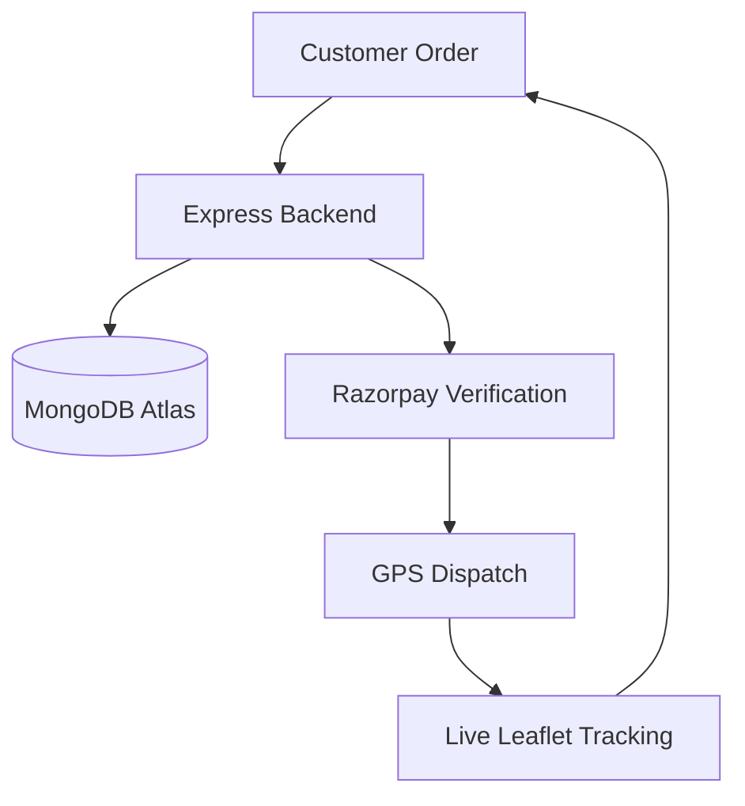

# DairyDash-Dairy-Platform.-
Hyperlocal quick commerce platform delivering farm-fresh dairy in under fifteen minutes.

   

"Morning(1) mist(2) clings(3) to(4) the(5) window(6) as(7) you(8) realize(9) the(10) milk(11) carton(12) is(13) bone-dry.(14) The(15) kids(16) will(17) wake(18) soon,(19) hungry(20) and(21) impatient.(22) You(23) tap(24) DairyDash,(25) and(26) before(27) the(28) coffee(29) brews,(30) a(31) chilled(32) bottle(33) of(34) farm-fresh(35) cream(36) settles(37) at(38) your(39) door.(40)"

## WHAT THIS DOES
DairyDash is a hyperlocal quick commerce platform designed for the rapid delivery of fresh dairy products. It solves the "Morning Shortage" problem by connecting local farms directly to urban consumers through a real-time inventory and GPS tracking system. The platform features an automated backend for order fulfillment and a comprehensive admin dashboard for monitoring delivery logistics and revenue analytics.
## TECH STACK
| Layer | Technology |
| :--- | :--- |
| Backend | Node.js / Express |
| Frontend | HTML5 / Vanilla JS / Leaflet.js |
| Database | MongoDB Atlas |
| Payments | Razorpay Integration |
| Animations | AOS (Animate On Scroll) |

## QUICK START
```bash
# 1. Clone
git clone https://github.com/ayushjhaa1187-spec/DairyDash-Dairy-Platform.-

# 2. Install
cd backend && npm install

# 3. Run
npm start
```
"Expected output: Server running and frontend accessible via the root index.html."

## FEATURES TABLE
| Feature | Why it matters |
| :--- | :--- |
| GPS Tracking | Live Leaflet.js map integration for real-time delivery transparency. |
| Admin Dashboard | Enterprise-grade console for managing products, orders, and revenue. |
| Razorpay Gateway | Secure, one-click payment processing for a frictionless checkout experience. |
| Dynamic Inventory | Real-time stock updates synced between the farm and the consumer app. |
| AOS Animations | Premium visual feedback on scroll to enhance user engagement. |

## HOW IT WORKS

DairyDash operates on a decoupled architecture where the root HTML frontend communicates with an Express.js API hosted in the /backend directory. When an order is placed, the backend verifies payment via Razorpay, updates the MongoDB inventory, and triggers a GPS dispatch event. The frontend then uses Leaflet.js to pull live coordinates, providing the user with a real-time delivery countdown.

## PROJECT STRUCTURE
```
DairyDash-Dairy-Platform.-/
|-- backend/      # Express.js API, routes, and Mongoose models
|-- images/       # High-resolution dairy product and UI assets
|-- css/          # Responsive stylesheets and animation definitions
|-- index.html    # Core customer landing and ordering portal
|-- admin.html    # Internal management and analytics dashboard
\-- package.json  # Global project manifest
```

## CONFIGURATION
```javascript
// backend/config.js
module.exports = {
  MONGO_URI: process.env.MONGO_URI,     // MongoDB connection string
  JWT_SECRET: process.env.JWT_SECRET,   // Token encryption key
  RAZORPAY_KEY: process.env.RAZORPAY_KEY // Payment gateway identifier
};
```

## ROADMAP
| Feature | Status | Priority |
| :--- | :--- | :--- |
| Core Dispatch | [x] Done | High |
| Subscription | [/] In Progress | Medium |
| Farm-side App | [ ] Planned | Low |

## CONTRIBUTING
We are looking for help with the automated route optimization logic.
1. Fork -> 2. Branch (git checkout -b feat/route-opt) -> 3. PR -> 4. Review


## LICENSE + FOOTER
License: MIT
Built by ayushjhaa1187-spec . Give it a star if it helped you
